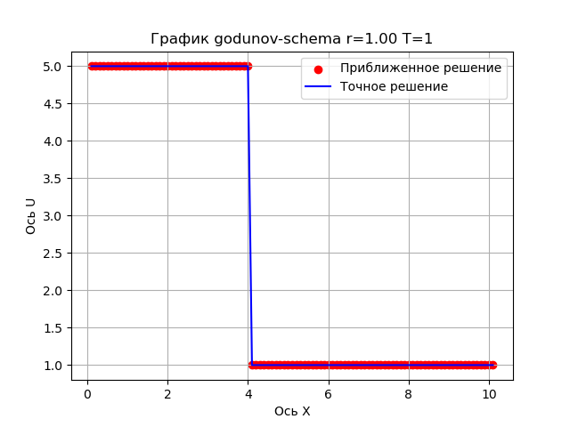

# Отчёт

## Схема Годунова

$\frac{u_j^{n+1} - u_j^n}{\tau} - a\frac{u_j^n - u_{j-1}^n}{h} = 0$

Выразим $u_j^{n+1}$, заменяя $\frac{a\tau}{h}$ на $r$:

$u_j^{n+1} = u_j^n (1-r) + ru_{j-1}^n$

### Графики

 
 
 
 
 
 
 
 
 
 
 

### Комментарий

Разброс точек при $r = 1.25$ связан с тем, что неявной схема неустойчива при $r > 1$

## Неявная схема

$\frac{u_j^{n+1} - u_j^n}{\tau} - a\frac{u_{j+1}^{n+1} - u_{j-1}^{n+1}}{2h} = 0$

Преобразуем к уравнению вида $a_ju_{j-1}^{n+1} + с_ju_j^{n+1} + b_ju_{j+1}^{n+1} = f_j$, заменяя $\frac{a\tau}{h}$ на $r$:

$u_j^{n+1} - u_j^n + \frac{r}{2}(u_{j+1}^{n+1} - u_{j-1}^{n+1}) = 0$

$-\frac{r}{2}u_{j-1}^{n+1} + u_j^{n+1} + \frac{r}{2}u_{j+1}^{n+1} = u_j^n$

Рассмотрим уравнение при $j \in [1, N-1]$:

$j = 0: -\frac{r}{2}u_0^{n+1} + u_1^{n+1} + \frac{r}{2}u_2^{n+1} = u_1^n \Rightarrow u_1^{n+1} + \frac{r}{2}u_2^{n+1} = u_1^n + \frac{r}{2}u_0^{n+1}$ , где $u_0^{n+1}$ - граничное условие

$j \in [1, N-2]:-\frac{r}{2}u_{j-1}^{n+1} + u_j^{n+1} + \frac{r}{2}u_{j+1}^{n+1} = u_j^n$

$j = N-1: -\frac{r}{2}u_{N-2}^{n+1} + u_{N-1}^{n+1} + \frac{r}{2}u_N^{n+1} = u_N-1^n \Rightarrow -\frac{r}{2}u_{N-2}^{n+1} + u_{N-1}^{n+1} = u_{N-1}^n - \frac{r}{2}u_N^{n+1}$ , где $u_N^{n+1}$ - граничное условие

Составим матрицу и вектора для метода прогонки:

$$
    \begin{bmatrix}
    1 & \frac{r}{2} & 0 & 0 & \cdots & 0 \\
    -\frac{r}{2} & 1 & \frac{r}{2} & 0 & \cdots & 0 \\
    0 & -\frac{r}{2} & 1 & \frac{r}{2} & \cdots & 0 \\
    \vdots & \vdots & \vdots & \vdots & \ddots & \vdots \\
    0 & 0 & 0 & -\frac{r}{2} & 1 & \frac{r}{2} \\
    0 & 0 & 0 & 0 & -\frac{r}{2} & 1 \\
    \end{bmatrix}
    \begin{bmatrix}
    u_1^{n+1} \\
    u_2^{n+1} \\
    u_3^{n+1} \\
    \vdots \\
    u_{N-2}^{n+1} \\
    u_{N-1}^{n+1} \\
    \end{bmatrix}
    =
    \begin{bmatrix}
    u_1^n + \frac{r}{2}u_0^{n+1} \\
    u_2^n \\
    u_3^n \\
    \vdots \\
    u_{N-2}^n \\
    u_{N-1}^n - \frac{r}{2}u_N^{n+1} \\
    \end{bmatrix}
$$

### Графики

 
 
 
 
 
 
 
 
 
 
 
